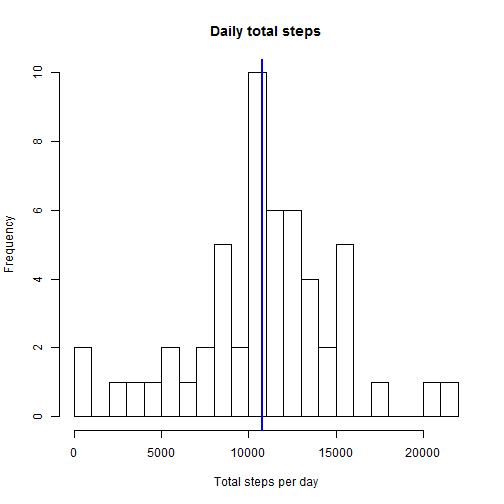
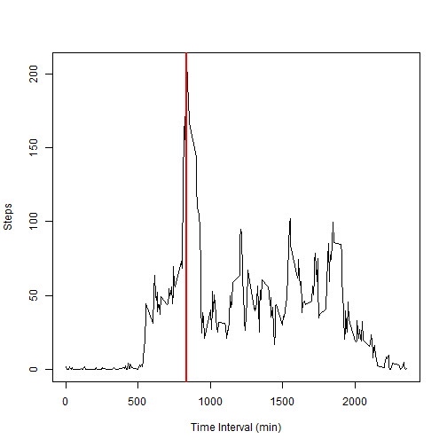
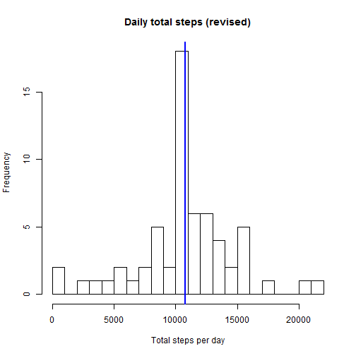

In this report, we analyzed a few aspects of the subject's daily excercise data. To do that, we first downloaded the data from the link provided by the course, and saved the unzipped .csv file in our working directory. We made sure that the .rmd file and the .csv files are in the same directory.

We started by summarizing the distribution of the total steps the subject took per day, and caculated the mean and median of this measure. Blue vertical line indicates position of the median.


```r
StepsRecord<-read.csv("activity.csv", header = TRUE, na.string = "NA")
TotalPerDay<-aggregate(steps~date,data=StepsRecord,sum) ## NA values removed by using the formula flavor of the aggregate function
hist(TotalPerDay$steps,breaks=20, main="Daily total steps",xlab="Total steps per day")
abline(v=(MedianDailyTotal<-mean(TotalPerDay$steps)), col="blue",lwd=2)
```

 

```r
print (MeanDailyTotal<-mean(TotalPerDay$steps))
```

```
## [1] 10766
```

```r
print (MedianDailyTotal)
```

```
## [1] 10766
```

We then analyzed how the activity level fluctuated by time of the day, and found out which 5-minute interval, on average across all the days in the dataset, contains the maximum number of steps. Red vertical line indicates the position of the maximum.


```r
AvgAtInterval<-aggregate(steps~interval,data=StepsRecord,mean) ## NA values automatically removed
plot(AvgAtInterval$interval, AvgAtInterval$steps,type="l",xlab="Time Interval (min)", ylab="Steps")
abline(v=(peak<-AvgAtInterval$interval[match(max(AvgAtInterval$steps),AvgAtInterval$steps)]), col="red", lwd=2)
```

 

```r
print (peak)
```

```
## [1] 835
```
The number of rows in the orginal dataset with NA's is:

```r
sum(rowSums(is.na(StepsRecord)))
```

```
## [1] 2304
```
We replaced these NA's with the average number of steps for that time interval across all 288 such intervals, resulting in a new dataset "NaIncluded".

```r
NaIncluded <- cbind(StepsRecord,Avg=AvgAtInterval$steps)
suppressWarnings(NaIncluded$steps[is.na(NaIncluded$steps)]<-NaIncluded$Avg)
NaIncluded<-NaIncluded[c("steps","date","interval")]
head(NaIncluded,5)
```

```
##     steps       date interval
## 1 1.71698 2012-10-01        0
## 2 0.33962 2012-10-01        5
## 3 0.13208 2012-10-01       10
## 4 0.15094 2012-10-01       15
## 5 0.07547 2012-10-01       20
```
We further described the total daily activity with the revised dataset. The intergerized mean and median values did not change from before, because NA's were replaced by means. There was a slight change in the median value, which only shows up in the decimal part.

```r
NewTotalPerDay<-aggregate(steps~date,data=NaIncluded,sum) ## no NA's to remove
hist(NewTotalPerDay$steps,breaks=20, main="Daily total steps (revised)",xlab="Total steps per day")
abline(v=(NewMedianDailyTotal<-mean(NewTotalPerDay$steps)), col="blue",lwd=2)
```

 

```r
print (NewMeanDailyTotal<-mean(TotalPerDay$steps))
```

```
## [1] 10766
```

```r
print (NewMedianDailyTotal)
```

```
## [1] 10766
```
Finally, to separate the data into "weekday" and "weekend", we first calculated days of the week for the recorded dates.

```r
wd<-weekdays(as.Date(NaIncluded$date,format="%Y-%m-%d"))
```
Then we added this column to the dataset to generate another dataset, and replaced individual weekdays with either "weekend" or "weekday".

```r
ByWD<-cbind(NaIncluded,wd)
ByWD<-within(ByWD, levels(wd)[levels(wd) == "Saturday"] <- "weekend")
ByWD<-within(ByWD, levels(wd)[levels(wd) == "Sunday"] <- "weekend")
ByWD<-within(ByWD, levels(wd)[levels(wd) != "weekend"] <- "weekday")
head(ByWD,5)
```

```
##     steps       date interval      wd
## 1 1.71698 2012-10-01        0 weekday
## 2 0.33962 2012-10-01        5 weekday
## 3 0.13208 2012-10-01       10 weekday
## 4 0.15094 2012-10-01       15 weekday
## 5 0.07547 2012-10-01       20 weekday
```
We grouped the data by weekend or weekday and calculated the average number of steps at each time interval, which we then plotted as steps vs interval, for either group.

```r
library(lattice)
WDAvg<-aggregate(steps ~ interval + wd, data = ByWD, mean)
xyplot(steps ~ interval | wd, data=WDAvg,type="l",layout=c(1,2), xlab="Interval", ylab="Number of steps")
```

 
